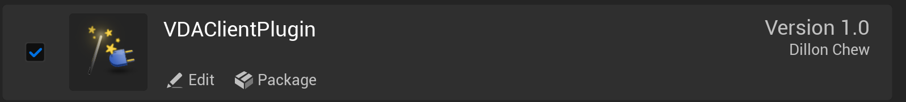

# Install RMF2 For Unreal from source

### Step 1: Add Plugin to Your Project

1. Navigate to your Unreal Engine project directory

1. Create a `Plugins` folder in your project root if it doesn't exist

1. Clone or download this repository inside the `Plugins` folder

   ```sh
   git clone https://github.com/ros-industrial/rmf2-unreal
   ```

   Your project structure should look like this:

   ```
   <YourProjectName>/
   ├── Content/
   ├── Source/
   ├── Plugins/
   │   └── RMF2ForUnreal/
   │       ├── RMF2ForUnreal.uplugin
   │       ├── Documentation/
   │       ├── Resources/
   │       ├── Source/
   │       └── ThirdParty/
   ├── Config/
   ├── <YourProjectName>.uproject
   └── ...
   ```

1. Configure compilation toolchains (5.3.2)

   ```sh
   export UNREAL_ENGINE_DIR=<path_to_unreal_engine>
   export UNREAL_ENGINE_COMPILER_DIR=$UNREAL_ENGINE_DIR/Engine/Extras/ThirdPartyNotUE/SDKs/HostLinux/Linux_x64/v22_clang-16.0.6-centos7/x86_64-unknown-linux-gnu
   export UNREAL_ENGINE_LIBCXX_DIR=$UNREAL_ENGINE_DIR/Engine/Source/ThirdParty/Unix/LibCxx
   ```

1. Compile RMF2 dependencies for Unreal

   Change to the `rmf2-unreal/Extern` directory,
   ```sh
   cd rmf2-unreal/Extern
   ```

   and execute the following commands to build and install a **Debug** version
   ```sh
   cmake -B build -S . -DCMAKE_BUILD_TYPE=Debug
   cmake --build build --target install
   ```

   To build a **Release** version, do the following:
   ```sh
   cmake -B build -S . -DCMAKE_BUILD_TYPE=Release
   cmake --build build --target install
   ```

### Step 2: Enable the Plugin

> [!NOTE]
> Usually don't need to, but if somehow it is not enabled after cloning the repository, Do this.

1. Open your project in Unreal Engine Editor

1. Go to (Top Left) **Edit → Plugins**

1. Search for "RMF2"

  

1. Check the box next to **RMF2ForUnreal** to enable it

1. Click **Restart Now** when prompted (or just restart after enabling it)
