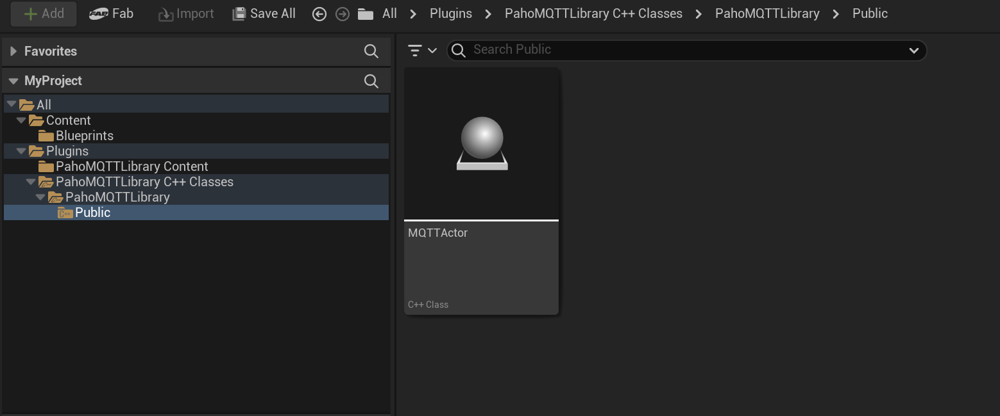
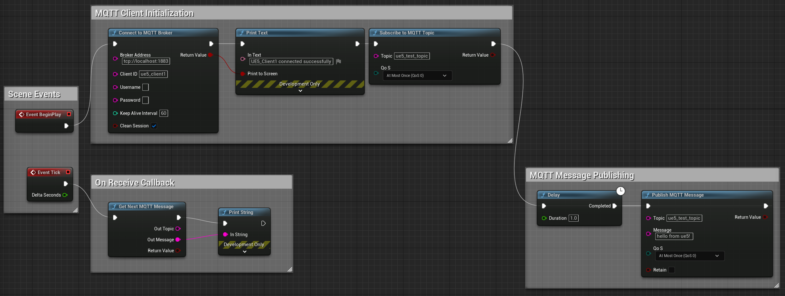

# MQTT Actor

After successfully installing your Unreal Engine Editor, you should be able to see the plugin



1. Right click `MQTTActor` Asset and select `Create Blueprint class based on MQTTActor`

1. Save your Blueprint (preferable under `Content > Blueprints`)

1. Go to your newly created Blueprint in the `Content Editor`, drag your new Blueprint to `Viewport`

1. In the `Outliner` (top right list), find your new `MQTTActor` and click `Edit <your actor name>`

1. Go to `Event Graph` Tab

1. Add a Blueprint node by right clicking the anywhere in the event graph and search for the nodes shown in the picture below.

1. Add a loopback from the Publish MQTT Message node back to the delay entry to keep it inside a loop!)

1. Configure connection settings (`broker address`, `port`, `client ID`)

1. Use Blueprint nodes to:
   - Connect to MQTT broker
   - Subscribe to topics
   - Publish messages
   - Handle received messages

   

1. Save your blueprint!


## Demonstration

1. To test the connectivity to broker. Run the mosquitto broker first before simulation

  ```bash
  mosquitto -p 1883 -v
  ```

  Note: if the port 1883 is used, execute the command below and re-execute the command above.

  ```bash
  sudo systemctl stop mosquitto
  ```

2. Run the simulation by pressing the `play` button. You should be able to see connection and subscription acknowledgement
   
