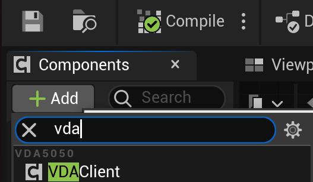
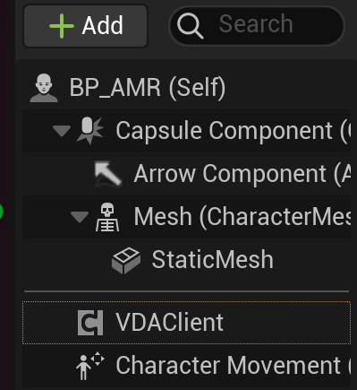
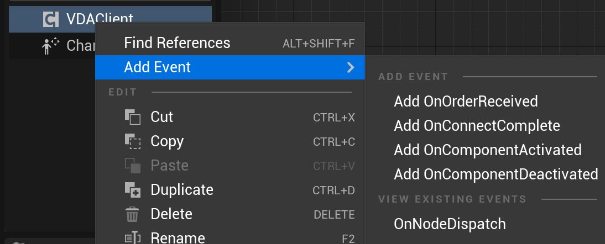
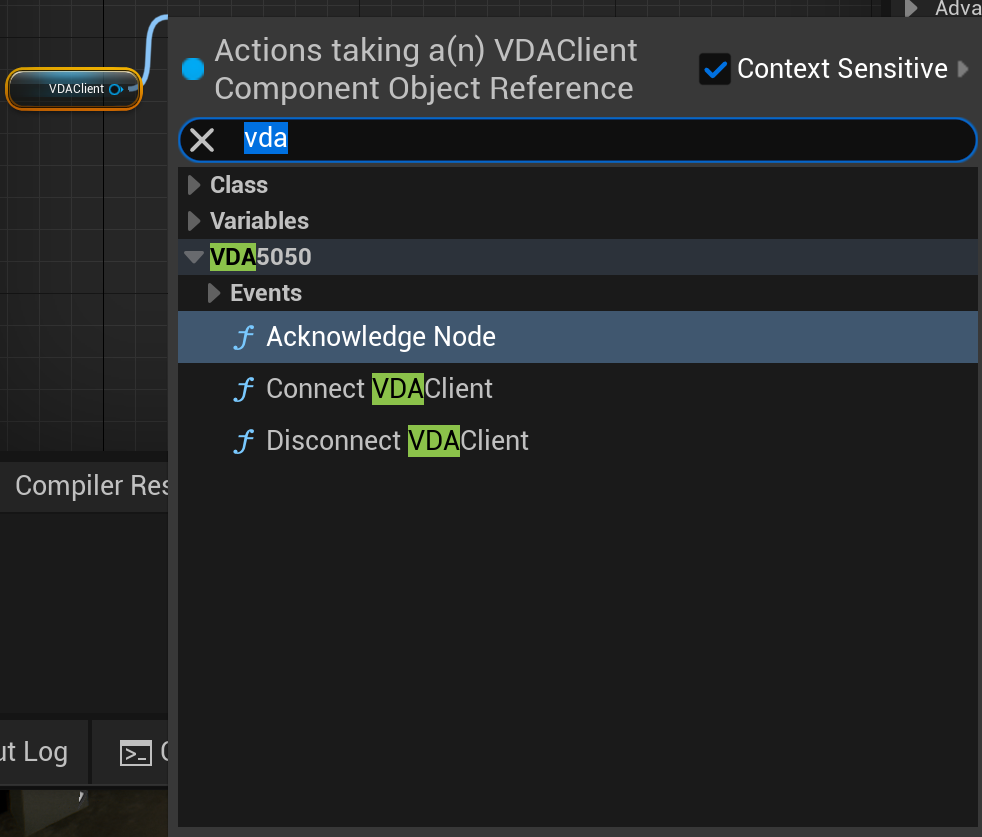
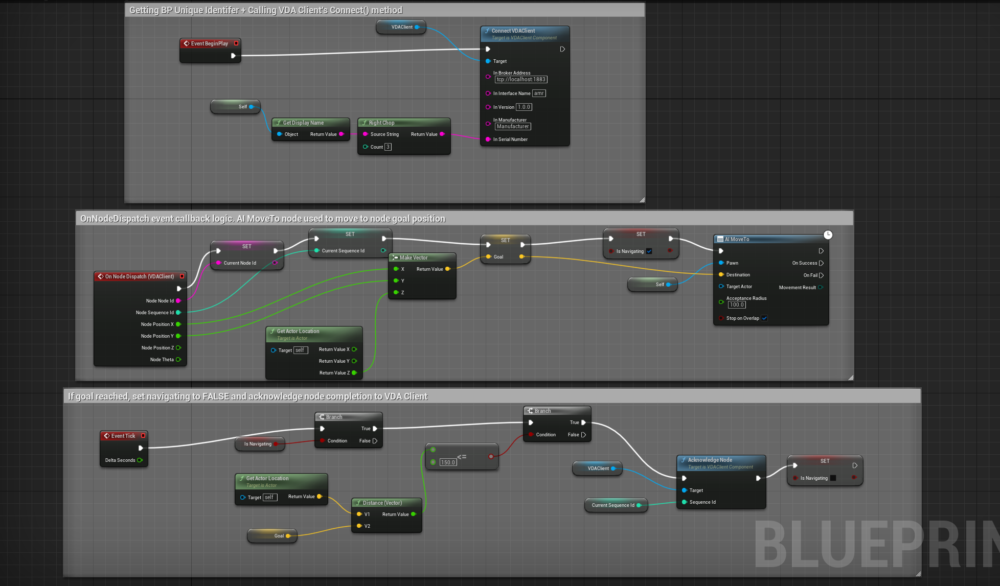

# VDA5050 Client Plugin
A Unreal Engine 5 plugin that integrates the [VDA5050_client library](https://github.com/ros-industrial/vda5050_client) as a component for Actor classes.

## Prerequisites

- **Unreal Engine**: 5.3.1
- **Platform**: Ubuntu 22.04
- **MQTT Broker**: Required for MQTT communication

## Installation

### Step 1: Add Plugin to Your Project

1. Clone or download this repository
```bash
git clone git@gitlab.com:ROSI-AP/rmf2/ue/VDA5050ClientPlugin.git
```
2. Navigate to your Unreal Engine project directory
3. Create a `Plugins` folder in your project root if it doesn't exist
4. Copy the `VDA5050ClientPlugin` folder into the `Plugins` directory

Your project structure should look like this:
```
<YourProjectName>/
├── Content/
├── Source/
├── Plugins/
│   └── VDA5050ClientPlugin/
│       ├── VDA5050ClientPlugin.uplugin
│       ├── Resources/
│       ├── Source/
│       └── ThirdParty/
├── Config/
├── <YourProjectName>.uproject
└── ...
```

### Step 2: Enable the Plugin (Usually don't need to, but if somehow it is not enabled after copy-pasting, Do this)

1. Open your project in Unreal Engine Editor
2. Go to (Top Left) **Edit → Plugins**
3. Search for "VDA5050ClientPlugin"

   

4. Check the box next to **VDA5050ClientPlugin** to enable it
5. Click **Restart Now** when prompted (or just restart after enabling it)

# VDA5050Client Component


1. To add the `VDA5050Client Component` into an `Actor`, click on `Add` under the `Components` tab in the Actor Blueprint and search for `VDA5050Client`.

   

1. Upon succesfully adding the `Component` to an `Actor`,
the `VDA5050Client` Component will be visible under the `Components` tab.

   


## Component Details

Under the `Details` tab of the `Component` (top right window), configure the following properties:


### Connection

Used to construct the VDA5050 MQTT topic structure (`<InterfaceName>/<Version>/<Manufacturer>/<SerialNumber>/<topic>`) and establish the broker connection.

| Parameter | Type | Default | Description |
|-----------|------|---------|-------------|
| `BrokerAddress` | String | `tcp://localhost:1883` | MQTT broker address and port|
| `InterfaceName` | String | `""` | VDA5050 interface name, used as the first segment of the MQTT topic path |
| `Version` | String | `2.0.0` | VDA5050 protocol version. Determines the message schema and topic structure |
| `Manufacturer` | String | `Manufacturer` | AGV manufacturer identifier. Used in topic construction and state messages |
| `SerialNumber` | String | `""` | Unique AGV serial number. Each AGV instance must have a distinct value. **NOTE**: This is instance-editable, so it can be set per-actor in the level |
| `bAutoConnect` | Boolean | `false` | When enabled, the component will automatically connect to the broker on BeginPlay. If disabled, you must call `Connect()` manually from Blueprint. **NOTE**: If there are multiple actor instances of the blueprint in the level, it is best to disable this unless `SerialNumber` is set to instance-editable. |


### State

Controls the component's state reporting behaviour.

| Parameter | Type | Default | Description |
|-----------|------|---------|-------------|
| `bPublishState` | Boolean | `true` | When enabled, the component periodically publishes AGV state messages (position, velocity, battery, order status, etc.) |


## Events and Blueprint Functions

### Events

Bindable event dispatchers that notify the owning actor of VDA5050 events.
Can be added into the event graph by right-clicking the `VDA5050Client` in the `Components` tab and hovering over `Add Event`.
Events handle incoming orders and connection status.



| Event | Parameter | Description |
|-------|-----------|-------------|
| `OnNodeDispatch` | `FVDA5050NodeInfo` | Fired when the next node in the current order is ready for execution. Contains the node ID, sequence ID, target position, and orientation. The target position can be further broken down into floating point variables `X`, `Y`, `Z`|
| `OnOrderReceived` | `FVDA5050OrderInfo` | Fired when a new order is received from the master control. Contains the full order with all nodes and the order/update IDs |
| `OnConnectComplete` | `bool bSuccess` | Fired when the MQTT connection attempt completes. `true` if connected successfully, `false` on failure |


### Blueprint Functions

Callable functions for controlling the `VDA5050Client` from Blueprint.
Functions can be accessed by left-clicking and dragging the `VDA5050Client` variable pin onto the event graph:



| Function | Parameters | Description |
|----------|-----------|-------------|
| `Connect` | BrokerAddress, InterfaceName, Version, Manufacturer, SerialNumber | Establish an MQTT connection to the broker and subscribe to the order topic. All parameters are optional and will fall back to the component's configured defaults if not provided |
| `Disconnect` | - | Gracefully disconnect from the MQTT broker and clean up subscriptions |
| `AcknowledgeNode` | SequenceId | Acknowledge completion of a dispatched node. Call this after the AGV has reached the node's target position. This advances the order to the next node |


## Demonstration

Example of the `VDA5050Client` Component being used with `AIMoveTo`


