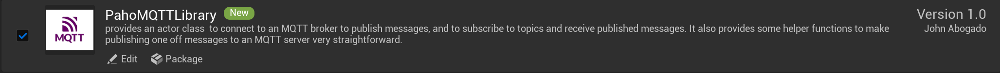
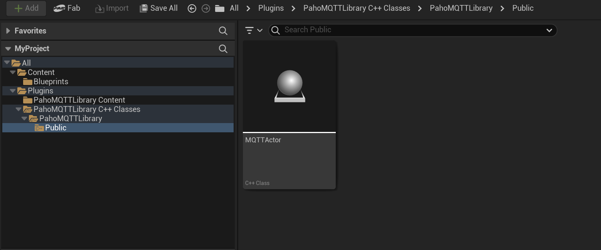
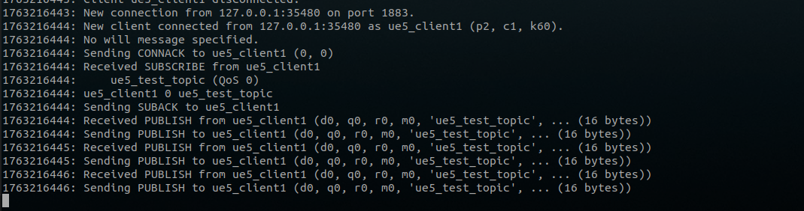

# PahoMQTTLibrary

A Unreal Engine 5 plugin that integrates Paho MQTT C library as Blueprint-accessible nodes for Actor classes.

## Prerequisites

- **Unreal Engine**: 5.3.1
- **Platform**: Ubuntu 22.04
- **Mosquitto Broker**: Required for MQTT communication

### Installing Mosquitto Broker
```bash
sudo apt-add-repository ppa:mosquitto-dev/mosquitto-ppa
sudo apt-get update
sudo apt-get install mosquitto mosquitto-clients
```
## Features

- **Connect**: Use the `Connect to MQTT Broker` node with your broker details
-  **Subscribe**: Subscribe to topics using `Subscribe to MQTT Topic` node you want to receive messages from
- **Publish**: Send messages to specific topics using `Publish MQTT Message`
- **Receive**: Use `Get Next MQTT Message` Node to receive the incoming message.

## Installation

### Step 1: Add Plugin to Your Project

1. Clone or download this repository
```bash
git clone git@gitlab.com:ROSI-AP/rmf2/ue/PahoMQTTLibrary.git
```
2. Navigate to your Unreal Engine project directory
3. Create a `Plugins` folder in your project root if it doesn't exist
4. Copy the `PahoMQTTLibrary` folder into the `Plugins` directory

Your project structure should look like this:
```
<YourProjectName>/
├── Content/
├── Source/
├── Plugins/
│   └── PahoMQTTLibrary/
│       ├── PahoMQTTLibrary.uplugin
│       ├── Resources/
│       ├── Source/
│       └── ...
├── Config/
├── <YourProjectName>.uproject
└── ThirdParty
└── ...
```

### Step 2: Enable the Plugin (Usually don't need to, but if somehow it is not enabled after copy-pasting, Do this)

1. Open your project in Unreal Engine Editor
2. Go to (Top Left) **Edit → Plugins**
3. Search for "PahoMQTTLibrary"

   

4. Check the box next to **PahoMQTTLibrary** to enable it
5. Click **Restart Now** when prompted (or just restart after enabling it)

## Usage

After restarting your Unreal Engine Editor, you should be able to see the plugin

   

1. Right click MQTTActor Asset and select `Create Blueprint class based on MQTTActor`
2. Save your blueprint (preferable under Content/Blueprints)
3. Go to your newly created blueprint in the content editor, drag your new blueprint to viewport
4. In the Outliner (top right list), find your new MQTT actor and click `Edit <your actor name>`
5. Go to Event Graph Tab
6. Add a blueprint node by right clicking the anywhere in the event graph and search for the nodes shown in the picture below.
(Add a loopback from the Publish MQTT Message node back to the delay entry to keep it inside a loop!)
5. Configure connection settings (broker address, port, client ID)
6. Use Blueprint nodes to:
   - Connect to MQTT broker
   - Subscribe to topics
   - Publish messages
   - Handle received messages

   
7. Save your blueprint! 


## Demonstration

1. To test the connectivity to broker. Run the mosquitto broker first before simulation

```bash
mosquitto -p 1883 -v
```

Note: if the port 1883 is used, execute the command below and re-execute the command above.

```bash
sudo systemctl stop mosquitto
```

2. Run the simulation by pressing the `play` button. You should be able to see connection and subscription acknowledgement
   