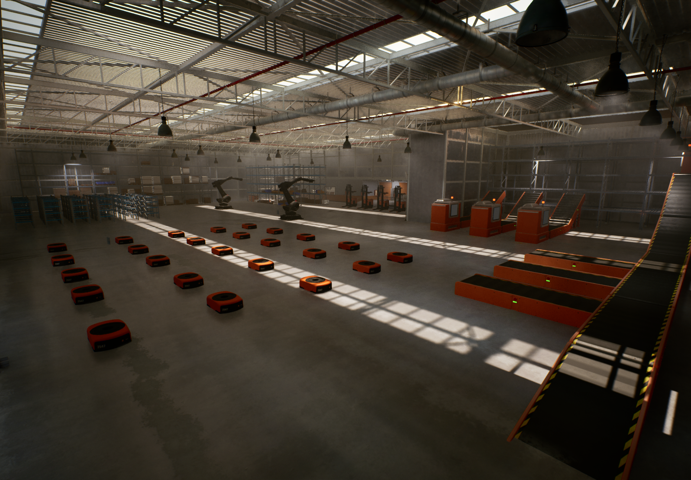

# RMF2 Plugins for Unreal Engine

`RMF2ForUnreal` plugins provides multi-robot simulation to Unreal Engine.

### 👏 Featured Demos

&nbsp;
 
 

### 🚀 Get Started

[Install **RMF2 For Unreal** from source](./Documentation/install-from-source.md)

### 📜 Documentation

- **Unreal Engine**: 5.3.2
- **Platform**: Ubuntu 22.04+

RMF2 Runtime Plugin

 - [Actor example with MQTT Pub/Sub](./mqtt-actor.md)

 - [VDA5050Client Component](./Documentation/vda5050-client-component.md)

### 📗 License

[Apache 2.0](http://www.apache.org/licenses/LICENSE-2.0.html).
RMF2 for Unreal is free for both commercial and non-commercial use.

